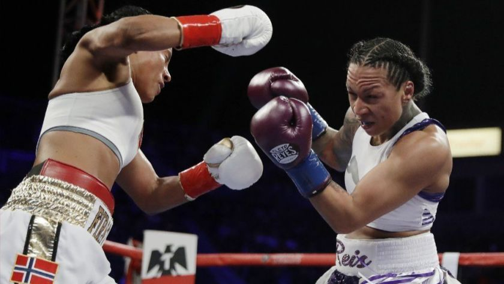

# Tensorflow-Object-Detection-API-to-Detect-Boxing-Gloves-

Tensorflow object detection API provides convenient tools to do object detection and instance segmentation which are two main tasks in computer vision. The equipped [model zoo](https://github.com/tensorflow/models/blob/master/research/object_detection/g3doc/detection_model_zoo.md) includes popular algorithms like ssd, faster rcnn, mask rcnn (for both bounding box & mask detection), with a variety of effective feature detectors like mobine net, resnet and inception resnet. The tradeoff between speed and accuracy of these models is thoroughly studied in this [paper](https://arxiv.org/pdf/1611.10012.pdf). Users can select a proper model as needed. The API provides easy-folowed pipeline to customize inputs, model parameters and evaluation metrics. The model training can be easily deployed on google cloud, with some supported by TPU. 

In this repository, I used tensorflow object detection API to do a very interesting job -- trying to detect boxing gloves and segment them during the boxers are fighting or training. The results can help us better appreciate the trajectory of boxing moves. Eventually, a set of continued frame images from a short video is displayed with the detected bounding boxes as well as masks for presented gloves. The training was done on google cloud.

The repository includes:

* Jupyter notebooks to visualize the detection on images [Gloves_detection_in_image.ipynb](https://github.com/fuqiong-yrym/Tensorflow-Object-Detection-API-to-Detect-Boxing-Gloves-/blob/master/Gloves_detection_in_image.ipynb)
* Jupyter notebooks to visualize the detection on video [Gloves_detection_in_video.ipynb](https://github.com/fuqiong-yrym/Tensorflow-Object-Detection-API-to-Detect-Boxing-Gloves-/blob/master/Gloves_detection_in_video.ipynb)

# Inputs Preparation:

* **Labeling:** Prepare images and annotations for training, evaluation and testing. The label tool selected is RectLabel for mac. RectLabel is simple and easy to use, also very handy since it has attracting features such as exporting compatible annotation formats, automatically generating label map, separating datasets and producing file list which are all required when using tensorflow detection API. In this example, training set contains ~150 images. 

<p align="center">
  
</p>

<p align="center">
   
  
  
  
 </p>

* **Inputs:** Convert images and annotations into TFRecord format. The masks were included. Tensorflow API provides sample tools to do this conversion. According to the annotation format (PASCAL, Coco, KITTI) choose the corresponding tool. You may need make some changes if the format in your hand does not fall into the provided ones. 

* **Configuration:** Prepare config file for the model. I modified the config sample provided by Tensorflow API to change two basic things: 1. number of output, 2. paths to files used for training and evaluation. These two places are a must to change when you uses your own datasets, otherwise errors are expected. This config file also allows you to set the checkpoint file from which the training starts. I used faster rcnn reset101 trained on COCO. 

# Training on Google Cloud:

A set of files need to be uploaded to the bucket of google cloud before you start to train, such as the prepared TFRecods, label_map, refining checkpoint and config file, etc. I chose Tensorflow version 1.12 on google cloud for training and evaluation. Mask rcnn model has higher detection accuracy but needs longer time to train, the training time is ~ 4 hours on GPU for this example. The training was stopped at ~ 145000 steps when the loss stablizes itself.

# Frozen detection graph:

After training, copy the latest checkpoint to local. Tensorflow obejct detection model only needs a frozen detection graph to do the inference. The API provides a module (object_detection/export_inference_graph.py) to extract the frozen detection graph from checkpoint.

# Visualization of detection on image

The Jupyter notebook [Gloves_detection_in_image.ipynb](https://github.com/fuqiong-yrym/Tensorflow-Object-Detection-API-to-Detect-Boxing-Gloves-/blob/master/Gloves_detection_in_image.ipynb) is a demo showing how to use tensorflow object detection API to detect and segment boxer gloves in the image. The skeleton of this notebook is provided by detection API. The path of the frozen graph trained based on your own datasets should be filled. 

The folowing image shows the detection and segmentation of the boxer gloves presented in the image.
<p align="center">
  
</p>

# Visulization of detection on video

The Jupyter notebook [Gloves_detection_in_video.ipynb](https://github.com/fuqiong-yrym/Tensorflow-Object-Detection-API-to-Detect-Boxing-Gloves-/blob/master/Gloves_detection_in_video.ipynb) is a demo showing how to use tensorflow object detection API to detect and segment boxer gloves in the video. Similarly, the path of the frozen graph trained based on your own datasets should be filled in. Model inference on mask rcnn takes ~30 sec per image, which makes it hard to use in a real time context. In this notebook, the python library moviepy is used to process every frame image in the video. Then these frames are concatenate to show the video with detected and segmented gloves. You may need to install moviepy first if necessary. 

## Install moviepy

   ```bash
   pip install moviepy
   ```

The following .gif animated the boxer gloves detection and segmentation. This video is in slow motion therefore we can see at some frames the model commits false positive and false negative errors. Increasing the size of training sample and utilizing the dataset augmentation are expected to improve the evaluation metrics.

<p align='center'>
  
</p>

